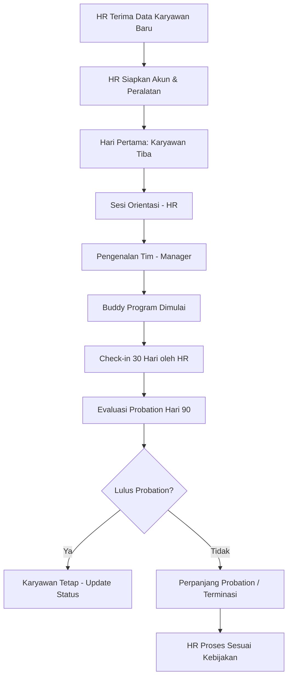

# Artifacts - Dokumen, Diagram, dan Output yang Bisa Langsung Digunakan

> **Level**: Intermediate - Co-work Track (Modul 2 dari 3)
> **Estimasi Waktu**: 30 menit
> **Prasyarat**: INTERMEDIATE-01 (Projects & Shared Context)

---

## Tujuan Pembelajaran

- Memahami apa itu Artifacts dan kapan Claude menggunakannya
- Mengenal jenis-jenis Artifacts yang tersedia
- Membuat dan mengedit Artifacts secara iteratif
- Membuat diagram alur proses HR menggunakan Mermaid
- Menshare dan mengekspor Artifacts

---

## 1. Apa itu Artifacts?

Artifacts adalah **panel dokumen yang muncul di sisi kanan** antarmuka claude.ai ketika Claude menghasilkan output yang cukup substansial - seperti dokumen lengkap, kode, diagram, atau halaman HTML.

**Mengapa Artifacts berguna:**
- Output tersimpan rapi di panel terpisah, tidak tenggelam dalam chat
- Bisa diedit langsung tanpa harus copy-paste ke tempat lain
- Bisa di-share via link
- Bisa di-copy dalam satu klik
- Bisa diiterasi dengan mudah ("ubah bagian ini", "tambahkan section baru")

**Cara memicu Artifacts:**
Claude secara otomatis membuat Artifact jika output cukup panjang atau terstruktur. Kamu juga bisa memintanya secara eksplisit:

```
Buatkan [dokumen/laporan/SOP/diagram] ini sebagai Artifact yang rapi.
```

---

## 2. Jenis-Jenis Artifacts

**A. Dokumen Teks (Markdown)**
- Laporan, SOP, kebijakan, panduan
- Format: Markdown (teks dengan heading, bullet, tabel)
- Dirender menjadi tampilan rapi di panel Artifacts

**B. Kode (Code)**
- Script Python, formula Excel, query SQL, script shell
- Dilengkapi syntax highlighting
- Bisa di-copy langsung dan dijalankan

**C. Diagram (Mermaid)**
- Flowchart, diagram alur proses, org chart, timeline
- Ditulis dalam syntax Mermaid dan dirender menjadi diagram visual
- Sangat berguna untuk SOP dan proses HR

**D. HTML / Halaman Web**
- Halaman HTML interaktif sederhana
- Bisa berisi tabel, form, atau tampilan visual
- Preview langsung di panel Artifacts

**E. SVG (Gambar Vektor)**
- Ilustrasi sederhana atau ikon
- Jarang digunakan dalam konteks HR

---

## 3. Membuat Dokumen sebagai Artifact

**Cara meminta dokumen sebagai Artifact:**

```
Buatkan SOP Rekrutmen untuk posisi non-manajerial dalam format
dokumen yang rapi (Artifact). Struktur:
1. Tujuan
2. Ruang Lingkup
3. Definisi
4. Langkah-Langkah Proses (flowchart singkat + penjelasan)
5. Dokumen Terkait
6. Riwayat Revisi

Bahasa formal, heading yang jelas, gunakan numbered list untuk langkah proses.
```

**Contoh hasil yang akan muncul di panel Artifacts:**
Claude akan membuat dokumen lengkap di panel kanan sementara percakapan tetap berlangsung di kiri.

---

## 4. Edit dan Iterasi Artifacts

Salah satu kekuatan Artifacts adalah kemudahan revisi. Kamu tidak perlu mulai dari nol.

**Cara minta revisi:**

Setelah Artifact terbuat, lanjutkan percakapan di kotak chat:

```
Di bagian "Langkah-Langkah Proses", tolong:
1. Tambahkan step "Background Check" sebelum step offer letter
2. Ubah timeline di setiap step menjadi lebih spesifik (berapa hari kerja)
3. Tambahkan kolom "PIC (Penanggung Jawab)" di setiap langkah
```

**Iterasi contoh lanjutan:**

```
Sekarang tambahkan section baru di akhir dokumen: "Eskalasi dan Pengecualian"
yang menjelaskan kapan harus eskalasi ke HR Manager dan apa saja kondisi
pengecualian dari prosedur standar ini.
```

**Tips iterasi yang efektif:**
- Minta perubahan spesifik, bukan "perbaiki dokumen ini"
- Sebutkan nama section atau bagian yang perlu diubah
- Bisa minta beberapa perubahan sekaligus dalam satu pesan
- Jika hasil tidak sesuai, minta Claude "coba lagi dengan pendekatan berbeda"

---

## 5. Membuat Diagram Alur Proses HR dengan Mermaid

Mermaid adalah bahasa untuk membuat diagram berbasis teks yang dirender menjadi gambar visual.

**Cara meminta diagram:**

```
Buatkan diagram flowchart proses onboarding karyawan baru menggunakan
Mermaid. Proses meliputi:
- HR menerima data karyawan baru dari rekrutmen
- HR menyiapkan akun dan peralatan
- Karyawan baru tiba di hari pertama
- Sesi orientasi (HR)
- Pengenalan tim (Manager)
- Buddy program selama 30 hari
- Check-in 30 hari oleh HR
- Evaluasi probation di hari 90

Gunakan decision point (berlian) untuk: apakah probation lulus?
```

**Contoh output Mermaid yang Claude akan buat:**



**Jenis diagram Mermaid yang berguna untuk HR:**

| Jenis Diagram | Syntax Mermaid | Kegunaan HR |
|---------------|---------------|-------------|
| Flowchart | `flowchart TD` | Proses rekrutmen, onboarding, offboarding |
| Sequence Diagram | `sequenceDiagram` | Alur komunikasi antar pihak |
| Gantt Chart | `gantt` | Timeline project atau program |
| Pie Chart | `pie` | Distribusi data survei |
| Org Chart | `graph TD` | Struktur organisasi |

**Contoh meminta Gantt Chart untuk program onboarding:**

```
Buatkan Gantt chart Mermaid untuk program onboarding 90 hari dengan
milestone: orientasi (minggu 1), integrasi tim (minggu 2-4),
mandiri dengan pendampingan (minggu 5-8), evaluasi probation (minggu 12).
```

---

## 6. Membuat Tabel dan Laporan sebagai Artifact

Claude bisa membuat tabel analisis, laporan perbandingan, dan matriks keputusan yang rapi.

**Contoh: Matriks Kompetensi**

```
Buatkan matriks kompetensi untuk posisi HR Generalist sebagai Artifact.
Kolom: Kompetensi | Level 1 (Junior) | Level 2 (Mid) | Level 3 (Senior)
Baris: 5-6 kompetensi utama HR Generalist.
Isi tiap cell dengan deskripsi perilaku yang observable (bukan sekedar "baik" atau "mahir").
```

**Contoh: Laporan Analisis Kebutuhan Training**

```
Buatkan template laporan Training Needs Analysis (TNA) sebagai Artifact.
Sertakan:
- Executive Summary section
- Metodologi pengumpulan data
- Tabel: Departemen | Gap Kompetensi | Prioritas | Metode Training Rekomendasi
- Rekomendasi program dengan estimasi biaya (placeholder)
- Timeline implementasi (Gantt sederhana dalam teks)
```

---

## 7. Sharing dan Export Artifacts

**Cara share Artifact:**

1. Buka Artifact di panel kanan
2. Klik ikon **share** atau **copy link** di pojok Artifact
3. Link yang dihasilkan bisa dibagikan ke orang lain
4. Penerima link bisa melihat Artifact (tapi tidak bisa edit jika bukan anggota project)

**Cara copy konten Artifact:**

1. Klik ikon **copy** di Artifact
2. Konten ter-copy ke clipboard
3. Paste ke dokumen Word, Google Docs, Notion, email, dll.

**Export untuk penggunaan lebih lanjut:**
- Teks/Markdown → Copy dan paste ke Word atau Google Docs
- Kode → Copy ke code editor atau file script
- Diagram Mermaid → Gunakan mermaid.live untuk export ke PNG/SVG
- HTML → Simpan sebagai file .html dan buka di browser

---

## 8. Praktik: Buat 1 SOP HR sebagai Artifact

**Latihan 10 menit:**

Gunakan prompt berikut di claude.ai:

```
Buatkan SOP Pengajuan Cuti Karyawan sebagai Artifact yang lengkap.

Struktur dokumen:
1. Tujuan dan Ruang Lingkup
2. Definisi (jenis-jenis cuti yang tersedia)
3. Persyaratan Pengajuan (dokumen, batas waktu pengajuan)
4. Alur Proses (buat juga sebagai Mermaid flowchart terpisah)
5. Tata Cara Penolakan dan Banding
6. Ketentuan Khusus (cuti mendadak, cuti panjang)
7. Referensi (kebijakan terkait)

Bahasa formal, sesuai konteks perusahaan Indonesia.
Format profesional dengan penomoran yang jelas.
```

Setelah mendapat Artifact pertama:
- Minta 1-2 revisi spesifik
- Minta diagram flowchart alur pengajuan cuti dalam Mermaid
- Copy hasil akhir ke dokumen kerja kamu

---

## Rangkuman

- Artifacts = panel dokumen terpisah di sisi kanan, muncul untuk output substansial
- 4 jenis Artifacts utama: teks/markdown, kode, diagram Mermaid, HTML
- Edit Artifacts secara iteratif dalam percakapan yang sama - tidak perlu mulai ulang
- Mermaid sangat berguna untuk membuat diagram proses HR secara visual
- Artifacts bisa di-share via link atau di-copy ke aplikasi lain

---

## Langkah Selanjutnya

- Lanjut ke **INTERMEDIATE-03**: Claude dalam Workflow Tim - Kolaborasi dan Sharing
- Latihan: Buat 1 SOP atau template HR favorit kamu sebagai Artifact hari ini
